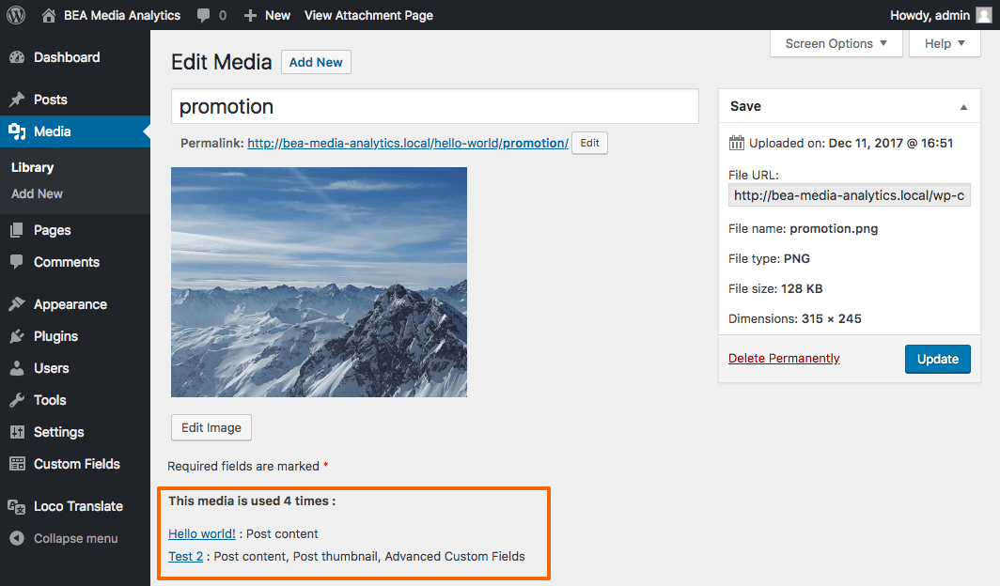
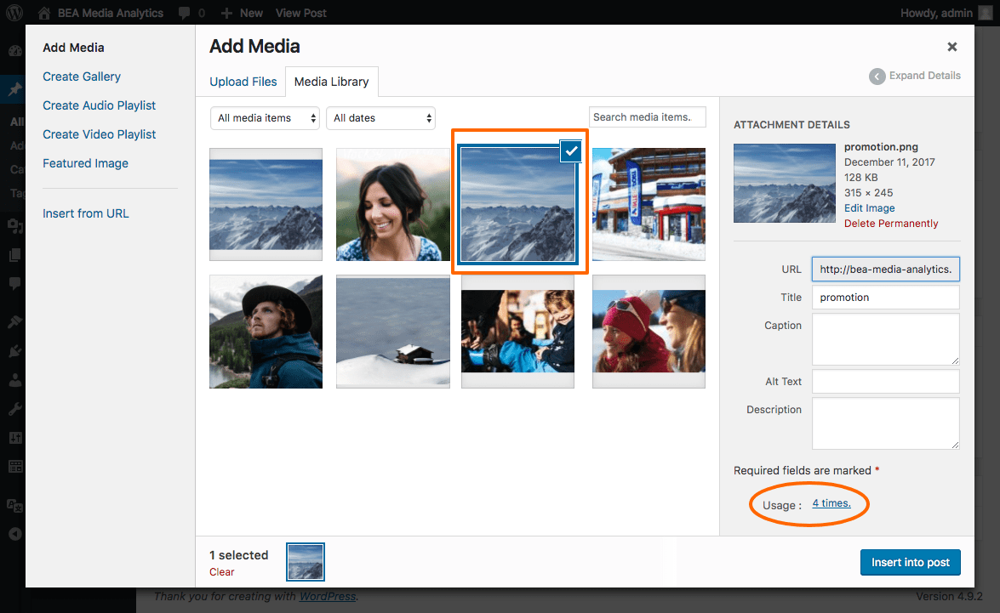
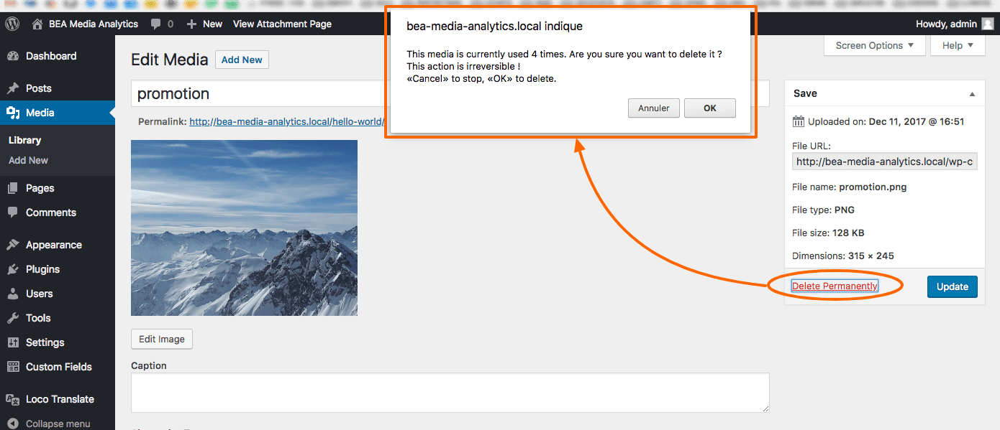

# BEA - Media Analytics

If you want to see which media is used and where ? This plugin is for you !

By installing this plugin you will index where your media are used, display further informations about how they are used and also warn you about deleting used ones. 

# How ?

A table is created for indexing where media are used. This is done when saving contents but could also be forced with the [wp-cli command](#force-indexation) or just by activating the plugin. 

# Requirements

- [WordPress](https://wordpress.org/) 4.7+
- Tested up to 4.9.1.
- **PHP 7.0** is required !!

# Installation

At plugin activation, a single event will be added in order to index your contents. It generally takes 10-15 min to do so.

At plugin deactivation, all data stored by this plugin will be **deleted** to ensure not to weighing the DB and also for further safe reactivation.

## WordPress

- Download and install using the built-in WordPress plugin installer.
- Site activate in the "Plugins" area of the admin.
- Optionally drop the entire `bea-media-analytics` directory into mu-plugins.
- Nothing more, this plugin is ready to use !

## [Composer](http://composer.rarst.net/)

- Add repository source : `{ "type": "vcs", "url": "https://github.com/BeAPI/bea-media-analytics" }`.
- Include `"bea/bea-media-analytics": "dev-master"` in your composer file for last master's commits or a tag released.
- Nothing more, this plugin is ready to use !

# What ?

## Features 

For now the supported contents for indexation are post types by focusing on :

- Post content ( gallery, image, links )
- Post thumbnail
- [Advanced Custom Fields PRO](https://www.advancedcustomfields.com/)'s fields

### Third party support

This plugin has third party support with following plugins :

* [Content Sync Fusion](https://github.com/BeAPI/bea-content-sync-fusion) : the usage counter will now consider synced sites to reveal how many times a media has been used across all synchronized sites.

### 1 - Single media view

In the single edit view, a bloc has been added to display the number of usages, where and what type.

### 2 - Media library modal view

In the media library modal view, when a media is selected, a bloc has been added to display the number of usages.

### 3 - Media library view

On the media admin library view, an admin column has been added to display the number of usages.

### 4 - Prompt on media delete

On media delete, if it has usages (based on indexed contents), a warning will prompt to confirm the media deletion.

## More features to come

As you can see, some [issues](../../issues?q=is%3Aissue+is%3Aopen+label%3Aquestion) are feature requests :
- More fields support (excerpt, post meta, etc)
- More type of support (widget, etc)
- More support (elementor, visual composer, polylang, -wpml-, etc)
- Media expiration
- Find unused media
- Media replacement
- More file's mime types

## Next Roadmap
- [39](https://github.com/BeAPI/bea-media-analytics/issues/39) : Improve display
- [33](https://github.com/BeAPI/bea-media-analytics/issues/33) : Ensure a lot of file's mime types support

## Languages

This plugin is translated into the following languages :
- English
- French
- More to come

## Contributing

Please refer to the [contributing guidelines](.github/CONTRIBUTING.md) to increase the chance of your pull request to be merged and/or receive the best support for your issue.

### Issues & features request / proposal

If you identify any errors or have an idea for improving the plugin, feel free to open an [issue](../../issues/new). Please provide as much info as needed in order to help us resolving / approve your request.

### Translation request / proposal

If you want to translate BEA - Media Analytics, the best way is to use the official way :
[WordPress.org GlotPress](https://translate.wordpress.org/projects/wp-plugins/bea-media-analytics).

You can, of course, just [create a pull request](../../compare) to our repository if you already done the translation.

## For developers

### WP-Cli

#### Force indexation

[WP-CLi](http://wp-cli.org) has been implemented to execute, only on the given site, an indexation of all retrieved data from all supported contents : `wp bea_media_analytics index_site`
 
##### Multisite

Optionally on a multisite :
* for a site : `wp bea_media_analytics index_site --url={url}`
* for the entire network : `wp bea_media_analytics index_site --url={url}`
* for all sites of all networks : `wp bea_media_analytics index_site --url=$(wp site list --fields=url)`

### REST Api

The [REST Api](https://developer.wordpress.org/rest-api/) has been used to display the number of usage for an attachment. The route `exemple.com/wp-json/wp/v2/media/{id}/` will return a custom field called `bea_media_analytics_counter` which represents how many times it has been used into supported contents.

### JSON API

WordPress is working a lot with the JSON API, that's why why the `bea_media_analytics_counter` attribute has been added into attachment's JSON responses.

# Who ?

Created by [Be API](https://beapi.fr), the French WordPress leader agency since 2009. Based in Paris, we are more than 30 people and always [hiring](https://beapi.workable.com) some fun and talented guys. So we will be pleased to work with you.

This plugin is only maintained, which means we do not guarantee some free support. Consider reporting an [issue](#issues--features-request--proposal) and be patient. 

If you really like what we do or want to thank us for our quick work, feel free to [donate](https://www.paypal.me/BeAPI) as much as you want / can, even 1€ is a great gift for buying cofee :)

## License

BEA - Media Analytics is licensed under the [GPLv3 or later](LICENSE.md).
